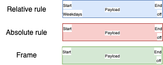
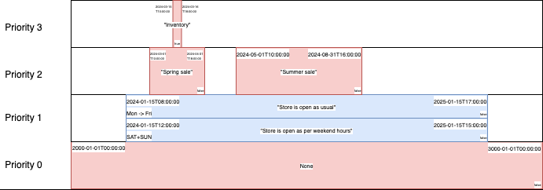

# Availability

A Rust library for managing complex time-based rules and schedules with priority-based overrides.

## Overview

`availability` helps you manage temporal rules and schedules in your application. It's particularly useful for:
- Store opening hours with holiday exceptions
- Service availability windows
- Resource scheduling with priority overrides
- Event calendars with recurring patterns
- Maintenance windows and blackout periods

## How Rules and Frames Work

### Priority-Based Rules System


The library uses a hierarchical priority system for managing time rules:

- **Priority 0**: Contains a non-modifiable base rule that spans all allowed date-times, serving as the foundation
- **Priority 1+**: Contains a mix of user specified rules, either relative or absolute. Absolute can not overlap their start-end, but relative rules can if their days don't match.

### Rule Processing


The animation demonstrates how rules interact:
- Higher priority rules take precedence over lower ones
- Each priority level can contain multiple non-overlapping rules
- Relative rules are converted to absolute rules.

### Frame Generation


When all rules are added, they are resolved and converted into a sequence of non-overlapping, time sorted frames. This results in a simple, sequential representation of availability.

## Key Features

- **Priority-Based Rules**: Define base schedules and override them with higher-priority rules
- **Flexible Rule Types**:
  - Absolute rules (specific dates/times)
  - Relative rules (recurring on specific weekdays)
- **Generic Payloads**: Attach custom, serializable, data to each time window
- **Conflict Prevention**: Built-in validation prevents overlapping rules at the same priority level
- **Frame Generation**: Automatically resolves overlapping rules from different priorities into non-overlapping frames

## Quick Start

```rust
use availability::{availability::Availability, rulebuilder::RuleBuilder};
use chrono::Datelike;
use serde::{Deserialize, Serialize};

#[derive(Serialize, Deserialize, Clone)]
struct StoreHours {
    staff_count: u32,
    manager_on_duty: String,
}

fn main() -> Result<(), Box<dyn std::error::Error>> {
    // 1) Create an empty Availability struct to store your schedule.
    let mut store_availability: Availability<StoreHours> = Availability::new();

    // 2) Define rules using RuleBuilder (string-based times in "YYMMDDHHMMSS" format).
    //    - Priority 1 (lowest): Open Mon-Fri from 09:00 to 17:00 (Jan 1 - Jan 31)
    let weekday_rule = RuleBuilder::new()
        .start_time_str("240101090000") // 2024-01-01 09:00:00
        .end_time_str("240131170000") // 2024-01-31 17:00:00
        .monday()
        .tuesday()
        .wednesday()
        .thursday()
        .friday()
        .payload(StoreHours {
            staff_count: 3,
            manager_on_duty: "Regular Manager".to_string(),
        })
        .build()?; // Validate & finalize

    //    - Priority 2: Special sale hours override (Jan 1 - Jan 7), open until 20:00
    let sale_rule = RuleBuilder::new()
        .start_time_str("240101090000") // 2024-01-01 09:00:00
        .end_time_str("240107200000") // 2024-01-07 20:00:00
        .weekdays(&["mon", "tue", "wed", "thu", "fri"])
        .payload(StoreHours {
            staff_count: 5,
            manager_on_duty: "Sale Team".to_string(),
        })
        .build()?;

    //    - Priority 3: Complete closure for inventory (Jan 15 - Jan 16)
    let inventory_rule = RuleBuilder::new()
        .start_time_str("240105000000") // 2024-01-15 00:00:00
        .end_time_str("240106000000") // 2024-01-16 00:00:00
        .off(true) // Off => store closed
        .payload(StoreHours {
            staff_count: 2,
            manager_on_duty: "Inventory Team".to_string(),
        })
        .build()?;

    // 3) Add the rules by ascending priority.
    store_availability.add_rule(weekday_rule, 1)?;
    store_availability.add_rule(sale_rule, 2)?;
    store_availability.add_rule(inventory_rule, 3)?;

    // 4) Convert the layered rules into "frames" that cover only the specified date range.
    store_availability.to_frames_in_range_str("240101000000", "240124235959");

    // Optional) Print out the resulting frames:
    println!("Store Schedule Overview:");
    println!("=======================");
    println!("{}", store_availability);

    // Optional) Get frame from datetime:
    println!("Get frames from datetime:");
    println!("=======================");
    let frame = store_availability
        .get_frame_from_str("240101090000")
        .unwrap();
    println!("Frame at 2024-01-01 09:00:00 is: {}", frame.off);
    if let Some(payload) = &frame.payload {
        println!("Staff Count: {}", payload.staff_count);
        println!("Manager on Duty: {}", payload.manager_on_duty);
    }

    Ok(())
}
```

## Advanced Features

- **Rule Builder**: Fluent API for creating rules with validation
- **Weekday Patterns**: Easy specification of recurring weekly schedules
- **Custom Payloads**: Attach any serializable data to your schedule windows
- **Conflict Detection**: Automatic validation of rule overlaps

## Installation

Add this to your `Cargo.toml`:

```toml
[dependencies]
availability = "0.1.0"
```

## License

Licensed under the MIT license.